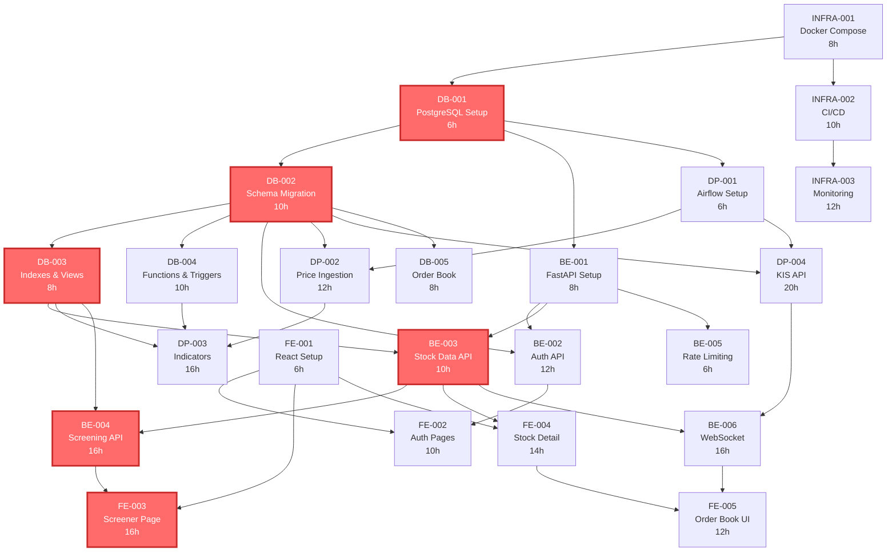

# Stock Screening Platform - Project Schedule

## 📋 Document Control

| Item | Details |
|------|---------|
| **Project Name** | Stock Screening Platform |
| **Document Version** | 1.0 |
| **Status** | Active |
| **Created Date** | 2025-11-09 |
| **Last Updated** | 2025-11-09 |
| **Authors** | Engineering Team |
| **Project Duration** | 6 weeks (Nov 11, 2025 - Dec 20, 2025) |

---

## 📊 Project Overview

### Project Summary

**Objective**: Launch MVP of Korean stock market (KOSPI/KOSDAQ) screening platform
**Total Effort**: 252 hours (approximately 31.5 person-days)
**Team Composition**: 5 people
- Frontend Developers: 2
- Backend Developers: 2
- DevOps Engineer: 1

### Success Criteria

- [x] User authentication system operational (login/signup)
- [x] Database schema deployed with 14+ tables
- [x] Daily price data ingestion pipeline running
- [x] 200+ indicators calculated daily
- [x] Stock screening functionality with < 500ms response time
- [x] Real-time data integration (KIS API)
- [x] CI/CD pipeline automated
- [x] MVP ready for beta launch

---

## 🎯 Sprint Overview

### Timeline

```
Week 1-2: Sprint 1 - Foundation
Week 3-4: Sprint 2 - Core Features
Week 5-6: Sprint 3 - Polish & Advanced Features
```

### Sprint Distribution

| Sprint | Duration | Effort | Primary Focus | Key Deliverables |
|--------|----------|--------|---------------|------------------|
| **Sprint 1** | Week 1-2 | 106h | Foundation | Dev environment, Authentication, Data pipeline |
| **Sprint 2** | Week 3-4 | 106h | Core Features | Screening API, 200+ indicators, KIS API integration |
| **Sprint 3** | Week 5-6 | 40h | Polish | WebSocket, Order book UI, Production monitoring |

---

## 📅 Sprint 1: Foundation (Week 1-2)

**Period**: November 11, 2025 - November 22, 2025
**Total Effort**: 106 hours (~13 person-days)

### Sprint Goals

- ✓ Development environment fully operational
- ✓ User authentication working (login/signup)
- ✓ Database schema deployed
- ✓ Daily price data ingestion pipeline running
- ✓ Basic stock listing API functional

### Week 1: November 11-15, 2025

#### Infrastructure & Database Setup

| Ticket ID | Task | Assignee | Priority | Hours | Dependencies | Status |
|-----------|------|----------|----------|-------|--------------|--------|
| INFRA-001 | Docker Compose Multi-Container Setup | DevOps | High | 8h | - | TODO |
| DB-001 | PostgreSQL + TimescaleDB Environment Setup | Backend-1 | Critical | 6h | - | TODO |
| DB-002 | Database Schema Migration Implementation | Backend-1 | Critical | 10h | DB-001 | TODO |

**Key Activities**:
- Set up PostgreSQL 16 with TimescaleDB extension
- Create 14+ database tables (stocks, daily_prices, users, portfolios, etc.)
- Configure TimescaleDB hypertables for time-series data
- Enable extensions: timescaledb, pg_trgm, uuid-ossp

#### Frontend & Backend Initialization

| Ticket ID | Task | Assignee | Priority | Hours | Dependencies | Status |
|-----------|------|----------|----------|-------|--------------|--------|
| FE-001 | React + Vite Project Setup | Frontend-1 | Critical | 6h | - | TODO |
| BE-001 | FastAPI Project Initial Setup | Backend-2 | Critical | 8h | DB-001 | TODO |

**Key Activities**:
- Initialize React 18 + TypeScript with Vite
- Install UI dependencies (Radix UI, Tailwind CSS, TanStack Query)
- Set up FastAPI with async SQLAlchemy
- Configure Redis connection and JWT authentication
- Create health check endpoints (/health, /health/db, /health/redis)

**Week 1 Checkpoint**:
- [ ] `docker-compose up` starts all services successfully
- [ ] PostgreSQL connection test passes
- [ ] Frontend dev server accessible at http://localhost:5173
- [ ] Backend API docs accessible at http://localhost:8000/docs
- [ ] All health checks return "healthy"

### Week 2: November 18-22, 2025

#### Database Optimization & Business Logic

| Ticket ID | Task | Assignee | Priority | Hours | Dependencies | Status |
|-----------|------|----------|----------|-------|--------------|--------|
| DB-003 | Indexes and Materialized Views Creation | Backend-1 | High | 8h | DB-002 | TODO |
| DB-004 | Database Functions and Triggers Implementation | Backend-1 | Medium | 10h | DB-002 | TODO |

**Key Activities**:
- Create performance indexes (trigram for fuzzy search, partial indexes)
- Implement materialized views (stock_screening_view, sector_performance)
- Set up TimescaleDB continuous aggregates (weekly, monthly)
- Create database functions (get_market_overview, get_hot_stocks, calculate_portfolio_value)
- Implement auto-update triggers (updated_at columns)

#### Authentication & Stock Data APIs

| Ticket ID | Task | Assignee | Priority | Hours | Dependencies | Status |
|-----------|------|----------|----------|-------|--------------|--------|
| BE-002 | User Authentication API Implementation | Backend-2 | Critical | 12h | BE-001, DB-002 | TODO |
| BE-003 | Stock Data API Implementation | Backend-2 | Critical | 10h | BE-001, DB-003 | TODO |

**Key Activities**:
- Implement JWT-based authentication (15-min access token, 30-day refresh token)
- Create endpoints: POST /v1/auth/register, /login, /refresh, /logout
- Implement bcrypt password hashing (cost factor 12)
- Build stock APIs: GET /v1/stocks, /stocks/{code}, /stocks/{code}/prices
- Implement Redis caching (5-min TTL for stock data)
- Add rate limiting middleware

#### Frontend Authentication Pages

| Ticket ID | Task | Assignee | Priority | Hours | Dependencies | Status |
|-----------|------|----------|----------|-------|--------------|--------|
| FE-002 | User Authentication UI Implementation | Frontend-1 | Critical | 10h | FE-001, BE-002 | TODO |

**Key Activities**:
- Create LoginPage and RegisterPage with react-hook-form
- Implement Zustand auth store with auto-refresh
- Build ProtectedRoute component
- Add Axios interceptors for token management
- Implement form validation (email format, password strength)

#### Data Pipeline Setup

| Ticket ID | Task | Assignee | Priority | Hours | Dependencies | Status |
|-----------|------|----------|----------|-------|--------------|--------|
| DP-001 | Apache Airflow Environment Setup | DevOps | High | 6h | DB-001 | TODO |
| DP-002 | Daily Price Ingestion DAG Implementation | Backend-1 | Critical | 12h | DP-001, DB-002 | TODO |

**Key Activities**:
- Install Apache Airflow 2.8 with PostgreSQL backend
- Configure Airflow connections (screener_db)
- Create daily_price_ingestion DAG (schedule: Mon-Fri 18:00 KST)
- Implement KRX API client with retry logic
- Add data validation (≥95% completeness check)
- Set up email alerts for pipeline failures

### Sprint 1 Definition of Done

- [ ] **Authentication**: User can register, login, and access protected routes
- [ ] **API Performance**: Stock listing < 100ms, detail < 150ms (p95)
- [ ] **Data Pipeline**: Daily price ingestion completes successfully (manual trigger test)
- [ ] **Database**: All migrations applied, indexes created, functions tested
- [ ] **Testing**: Unit tests for authentication (>80% coverage)
- [ ] **Documentation**: API endpoints documented in OpenAPI spec

### Sprint 1 Review

**Date**: November 22, 2025 (Friday, 4:00 PM)
**Duration**: 1 hour
**Attendees**: All team members
**Agenda**:
1. Demo: User authentication flow (5 min)
2. Demo: Stock listing and detail pages (5 min)
3. Demo: Airflow UI and price ingestion DAG (5 min)
4. Code review highlights (10 min)
5. Sprint retrospective (20 min)
   - What went well?
   - What could be improved?
   - Action items for Sprint 2
6. Sprint 2 planning preview (15 min)

---

## 📅 Sprint 2: Core Features (Week 3-4)

**Period**: November 25, 2025 - December 6, 2025
**Total Effort**: 106 hours (~13 person-days)

### Sprint Goals

- ✓ Stock screening functionality fully operational
- ✓ 200+ indicators calculated daily
- ✓ Real-time data integration (KIS API)
- ✓ Rate limiting protecting APIs
- ✓ CI/CD pipeline automated

### Week 3: November 25-29, 2025

#### Real-time Data Integration (Critical Path)

| Ticket ID | Task | Assignee | Priority | Hours | Dependencies | Status |
|-----------|------|----------|----------|-------|--------------|--------|
| DP-004 | KIS API Integration (Real-time Data) | Backend-1 | Critical | 20h | DP-001, DB-002 | TODO |

**Key Activities**:
- Implement OAuth 2.0 authentication with KIS API
- Build KIS API client with connection pooling (10-20 connections)
- Add rate limiting (20 req/sec with token bucket algorithm)
- Implement circuit breaker pattern (threshold: 5 failures, timeout: 60s)
- Set up Redis caching (prices: 30min TTL, order book: 10sec TTL)
- Create data source abstraction layer (KISDataSource, MockDataSource)

**Success Criteria**:
- [ ] OAuth token auto-refreshes before 24h expiration
- [ ] API latency < 200ms (p95)
- [ ] Cache hit rate > 80%
- [ ] Circuit breaker activates on failures
- [ ] Success rate > 99.9% during market hours

#### Indicator Calculation Pipeline

| Ticket ID | Task | Assignee | Priority | Hours | Dependencies | Status |
|-----------|------|----------|----------|-------|--------------|--------|
| DP-003 | Indicator Calculation DAG Implementation | Backend-1 | Critical | 16h | DP-002, DB-003, DB-004 | TODO |

**Key Activities**:
- Create IndicatorCalculator class with 200+ indicators
- Implement indicator categories:
  - **Valuation**: PER, PBR, PSR, PCR, EV/EBITDA, Dividend Yield (7 indicators)
  - **Profitability**: ROE, ROA, ROIC, Margins (7 indicators)
  - **Growth**: Revenue/Profit/EPS growth YoY, QoQ, CAGR (7 indicators)
  - **Stability**: Debt ratios, liquidity ratios, Z-Score, F-Score (8 indicators)
  - **Technical**: Price changes, volume, moving averages, RSI, MACD (20+ indicators)
  - **Composite Scores**: Quality/Value/Growth/Overall scores (4 indicators)
- Build indicator_calculation DAG (triggered after price ingestion)
- Batch process 2,400 stocks in < 30 minutes
- UPSERT to calculated_indicators table (batch commits: 100 stocks)
- Refresh materialized views (CONCURRENTLY)

**Success Criteria**:
- [ ] All 200+ indicators calculated for 2,400 stocks
- [ ] Calculation accuracy verified (manual spot-check 10 stocks)
- [ ] DAG execution < 30 minutes
- [ ] < 5% calculation failures

#### Core Screening API

| Ticket ID | Task | Assignee | Priority | Hours | Dependencies | Status |
|-----------|------|----------|----------|-------|--------------|--------|
| BE-004 | Stock Screening API Implementation | Backend-2 | Critical | 16h | BE-003, DB-003 | TODO |

**Key Activities**:
- Build dynamic query builder for filters
- Implement POST /v1/screen endpoint
- Use stock_screening_view materialized view
- Add Redis caching (key: `screening:{hash(filters)}:{page}`, TTL: 5min)
- Create predefined templates (dividend, value, growth, quality stocks)
- Optimize with EXPLAIN ANALYZE

**Success Criteria**:
- [ ] **Performance**: p99 < 500ms (CRITICAL TARGET)
- [ ] Simple queries < 200ms (p95)
- [ ] Cache hits < 50ms
- [ ] Multiple filters work (AND logic)
- [ ] Sorting and pagination accurate

#### Order Book Schema

| Ticket ID | Task | Assignee | Priority | Hours | Dependencies | Status |
|-----------|------|----------|----------|-------|--------------|--------|
| DB-005 | Order Book Schema and Storage | Backend-2 | Medium | 8h | DB-002 | TODO |

**Key Activities**:
- Create order_book table (stock_code, timestamp, bid/ask levels 1-10)
- Set up TimescaleDB hypertable with compression
- Create indexes for fast lookups
- Implement data retention policy (7 days)

### Week 4: December 2-6, 2025

#### Screener Frontend (Critical Feature)

| Ticket ID | Task | Assignee | Priority | Hours | Dependencies | Status |
|-----------|------|----------|----------|-------|--------------|--------|
| FE-003 | Stock Screener Page Implementation | Frontend-1, Frontend-2 | Critical | 16h | FE-001, BE-004 | TODO |

**Key Activities**:
- Build two-column layout (filters left, results right)
- Create FilterPanel with collapsible sections
  - Market filter (KOSPI/KOSDAQ/ALL)
  - Sector filter
  - Indicator range filters (PER, PBR, ROE, growth, etc.)
- Implement RangeFilter components (min/max validation)
- Build TemplateSelector (dropdown with predefined filters)
- Create ResultsTable with virtual scrolling (@tanstack/react-virtual)
- Add sortable columns and pagination
- Debounce filter changes (500ms)
- Save/restore filters in URL params

**Success Criteria**:
- [ ] Filters update results in real-time (debounced)
- [ ] Multiple filters combine with AND logic
- [ ] Template selection applies predefined filters
- [ ] Virtual scrolling handles 1000+ results smoothly
- [ ] Page load time < 1.5s
- [ ] Responsive (mobile, tablet, desktop)

#### Stock Detail Page

| Ticket ID | Task | Assignee | Priority | Hours | Dependencies | Status |
|-----------|------|----------|----------|-------|--------------|--------|
| FE-004 | Stock Detail Page Implementation | Frontend-2 | High | 14h | FE-001, BE-003 | TODO |

**Key Activities**:
- Create tab-based layout (Overview, Financials, Valuation, Technical)
- Build stock header (name, code, price, change%)
- Integrate TradingView Lightweight Charts
- Display metric cards (PER, PBR, ROE)
- Show financial statement tables
- Add watchlist/portfolio buttons
- Implement timeframe selection (1D, 1W, 1M, 3M, 6M, 1Y, 5Y)

#### API Protection & CI/CD

| Ticket ID | Task | Assignee | Priority | Hours | Dependencies | Status |
|-----------|------|----------|----------|-------|--------------|--------|
| BE-005 | API Rate Limiting and Throttling | Backend-2 | High | 6h | BE-001 | TODO |
| INFRA-002 | CI/CD Pipeline with GitHub Actions | DevOps | High | 10h | - | TODO |

**Key Activities (BE-005)**:
- Implement Redis-based rate limiter
- Configure tier-based limits:
  - Free: 100 req/min
  - Basic: 500 req/min
  - Pro: 2000 req/min
- Return 429 Too Many Requests with Retry-After header

**Key Activities (INFRA-002)**:
- Create GitHub Actions workflows
  - `.github/workflows/ci.yml` (lint, test, build)
  - `.github/workflows/cd.yml` (deploy to staging/production)
- Set up Docker image builds and push to registry
- Configure staging and production environments
- Add automated testing in CI pipeline
- Implement deployment health checks

### Sprint 2 Definition of Done

- [ ] **Screening Feature**: Users can filter stocks with 10+ criteria combinations
- [ ] **Indicators**: All 200+ indicators calculated with verified accuracy
- [ ] **KIS API**: Real-time data integrated with >99.9% success rate
- [ ] **Performance**: Screening p99 < 500ms, API p95 < 200ms
- [ ] **UI/UX**: Screener page responsive and accessible (WCAG 2.1 AA)
- [ ] **CI/CD**: Automated deployment to staging environment
- [ ] **Testing**: Integration tests for screening API (>80% coverage)

### Sprint 2 Review

**Date**: December 6, 2025 (Friday, 4:00 PM)
**Duration**: 1.5 hours
**Attendees**: All team members + Product stakeholders
**Agenda**:
1. Demo: Stock screening with multiple filters (10 min)
2. Demo: Real-time KIS API data integration (5 min)
3. Demo: 200+ indicators dashboard (5 min)
4. Demo: Stock detail page with charts (5 min)
5. Performance metrics review (10 min)
   - API response times
   - Indicator calculation time
   - KIS API reliability
6. CI/CD pipeline demonstration (5 min)
7. Sprint retrospective (20 min)
8. Sprint 3 planning and MVP readiness checklist (30 min)

---

## 📅 Sprint 3: Polish & Advanced Features (Week 5-6)

**Period**: December 9, 2025 - December 20, 2025
**Total Effort**: 40 hours (~5 person-days)

### Sprint Goals

- ✓ Real-time WebSocket price streaming operational
- ✓ Order book (호가) visualization for traders
- ✓ Production monitoring and alerting
- ✓ Performance optimization
- ✓ MVP ready for beta launch

### Week 5: December 9-13, 2025

#### Real-time Features

| Ticket ID | Task | Assignee | Priority | Hours | Dependencies | Status |
|-----------|------|----------|----------|-------|--------------|--------|
| BE-006 | WebSocket Real-time Price Streaming | Backend-2 | High | 16h | BE-003, DP-004 | TODO |

**Key Activities**:
- Implement WebSocket server with WSS (TLS)
- Create subscription system (room-based by stock code/market/sector)
- Add JWT authentication in WebSocket handshake
- Implement heartbeat (ping/pong every 30s)
- Set up Redis Pub/Sub for multi-instance broadcasting
- Create message types: price_update, orderbook_update, market_status, alert
- Add rate limiting (100 messages/sec per connection)
- Implement automatic reconnection with exponential backoff

**Success Criteria**:
- [ ] Supports 10,000+ concurrent connections
- [ ] Message latency < 100ms (p99)
- [ ] Delivery rate: 99.9%
- [ ] Graceful disconnection/reconnection

#### Order Book Visualization

| Ticket ID | Task | Assignee | Priority | Hours | Dependencies | Status |
|-----------|------|----------|----------|-------|--------------|--------|
| FE-005 | Order Book Visualization Component | Frontend-1 | Medium | 12h | FE-004, BE-006 | TODO |

**Key Activities**:
- Build two-column layout (Ask levels top, Bid levels bottom)
- Display 10-level depth (price, volume, cumulative volume)
- Show spread indicator (best_ask - best_bid)
- Add volume visualization bars (horizontal)
- Implement buy/sell pressure indicator
- Create freeze/unfreeze button
- Add flash animation on price changes
- Color coding (red for ask, blue for bid)
- Responsive behavior (10 levels desktop, 5 tablet, best bid/ask mobile)

**Success Criteria**:
- [ ] WebSocket updates < 100ms latency
- [ ] Smooth animations with 100+ updates/second
- [ ] Accessible (screen reader announces important changes)

#### Production Monitoring

| Ticket ID | Task | Assignee | Priority | Hours | Dependencies | Status |
|-----------|------|----------|----------|-------|--------------|--------|
| INFRA-003 | Production Monitoring and Logging Setup | DevOps | Medium | 12h | INFRA-002 | TODO |

**Key Activities**:
- Set up Prometheus for metrics collection
- Configure Grafana dashboards
  - API performance (response times, error rates)
  - Database metrics (query times, connections)
  - Cache metrics (hit rate, memory usage)
  - WebSocket metrics (connections, message rate)
  - KIS API metrics (success rate, circuit breaker status)
- Configure alerting rules
  - API p95 > 300ms
  - Error rate > 1%
  - Disk usage > 80%
  - KIS API circuit open
- Set up logging aggregation (consider ELK stack or simpler alternative)
- Create uptime monitoring (UptimeRobot or similar)

### Week 6: December 16-20, 2025

#### Integration Testing & Optimization Week

**Focus**: End-to-end testing, performance optimization, security hardening, documentation

| Category | Tasks | Assignee | Hours | Status |
|----------|-------|----------|-------|--------|
| **E2E Testing** | - User registration to stock screening flow<br>- Authentication flow (login, logout, token refresh)<br>- Screening with 10+ filter combinations<br>- Stock detail page navigation<br>- WebSocket connection and updates<br>- Order book real-time updates | QA + Frontend-1, Frontend-2 | 8h | TODO |
| **Performance Optimization** | - Identify bottlenecks with APM tools<br>- Optimize slow database queries<br>- Tune Redis cache settings<br>- Optimize frontend bundle size<br>- Implement code splitting<br>- Database query plan analysis | Backend-1, Backend-2 | 8h | TODO |
| **Security Audit** | - OWASP Top 10 verification<br>- SQL injection testing<br>- XSS vulnerability scanning<br>- CSRF protection verification<br>- Rate limiting stress testing<br>- JWT token security review<br>- Dependency vulnerability scan | Backend-2, DevOps | 6h | TODO |
| **Documentation** | - Update API documentation (OpenAPI/Swagger)<br>- Create deployment guide<br>- Update README.md with setup instructions<br>- Document environment variables<br>- Create troubleshooting guide<br>- Document monitoring and alerting | All team | 6h | TODO |
| **Beta Deployment** | - Deploy to production environment<br>- Run smoke tests<br>- Verify all health checks<br>- Test KIS API in production<br>- Monitor for errors (24-hour observation)<br>- Performance validation | DevOps + All | 4h | TODO |

#### Testing Checklist

**Functional Testing**:
- [ ] User can register, login, and logout
- [ ] Protected routes redirect unauthenticated users
- [ ] Stock listing pagination works
- [ ] Stock search (fuzzy) returns relevant results
- [ ] Screening with multiple filters returns accurate results
- [ ] Predefined templates apply correct filters
- [ ] Stock detail page shows accurate data
- [ ] Price charts render for all timeframes
- [ ] WebSocket connection establishes and receives updates
- [ ] Order book displays real-time bid/ask levels

**Performance Testing**:
- [ ] API p95 response time < 200ms (load test: 1000 req/min)
- [ ] Screening p99 < 500ms (complex queries)
- [ ] Page load time < 1.5s (Lighthouse score > 90)
- [ ] WebSocket handles 1000+ concurrent connections
- [ ] Cache hit rate > 80% (Redis monitoring)

**Security Testing**:
- [ ] SQL injection attempts blocked
- [ ] XSS payloads sanitized
- [ ] CSRF tokens validated
- [ ] Rate limiting enforces limits (429 after threshold)
- [ ] JWT signature validation works
- [ ] Password hashing uses bcrypt (cost 12)
- [ ] HTTPS enforced (TLS 1.3)

**Compatibility Testing**:
- [ ] Chrome 100+ ✓
- [ ] Safari 15+ ✓
- [ ] Firefox 100+ ✓
- [ ] Edge 100+ ✓
- [ ] Mobile Safari (iOS) ✓
- [ ] Chrome Mobile (Android) ✓

### Sprint 3 Definition of Done

- [ ] **Real-time Features**: WebSocket streaming and order book working
- [ ] **Performance**: All KPIs met (see metrics table below)
- [ ] **Security**: OWASP Top 10 compliance verified
- [ ] **Monitoring**: Grafana dashboards operational with alerts
- [ ] **Testing**: All E2E tests passing
- [ ] **Documentation**: Complete and up-to-date
- [ ] **Deployment**: Production environment stable for 24+ hours
- [ ] **Sign-off**: Product owner approves beta launch

### Sprint 3 Review & Beta Launch

**Date**: December 20, 2025 (Friday, 3:00 PM)
**Duration**: 2 hours
**Attendees**: All team members + Stakeholders + Product owner

**Agenda**:
1. **Final Demo** (30 min)
   - End-to-end user journey (registration → screening → stock detail)
   - Real-time features (WebSocket, order book)
   - Monitoring dashboard
2. **Metrics Review** (20 min)
   - Performance metrics vs targets
   - Data quality metrics
   - Uptime and reliability
3. **Security & Compliance** (10 min)
   - Security audit results
   - OWASP compliance
   - Data privacy (PIPA/GDPR)
4. **Operations Readiness** (15 min)
   - Deployment process
   - Monitoring and alerting
   - Incident response plan
5. **Sprint Retrospective** (20 min)
   - Overall project retrospective
   - Lessons learned
   - Process improvements for future sprints
6. **Beta Launch Decision** (15 min)
   - Go/No-go checklist review
   - Launch plan
   - Communication plan
7. **Celebration & Next Steps** (10 min)

---

## 📊 Key Performance Indicators (KPIs)

### Technical Performance Metrics

| Metric | Target | Measurement | Status |
|--------|--------|-------------|--------|
| **API Response Time (p95)** | < 200ms | Sentry APM / Prometheus | 🎯 Target |
| **Screening Query (p99)** | < 500ms | Database slow query log | 🎯 Target |
| **Page Load Time (p95)** | < 1.5s | Lighthouse CI / RUM | 🎯 Target |
| **Chart Rendering** | < 1s (252 data points) | Frontend profiling | 🎯 Target |
| **WebSocket Latency (p99)** | < 100ms | Custom metrics | 🎯 Target |
| **Concurrent Users** | 10,000+ | Load testing (k6) | 🎯 Target |
| **Cache Hit Rate** | > 80% | Redis INFO stats | 🎯 Target |
| **System Uptime** | 99.9% | Uptime monitoring | 🎯 Target |

### Data Quality Metrics

| Metric | Target | Measurement | Status |
|--------|--------|-------------|--------|
| **Daily Price Completeness** | ≥ 95% | check_data_completeness() | 🎯 Target |
| **Indicator Calculation Success** | ≥ 95% | Airflow DAG logs | 🎯 Target |
| **KIS API Success Rate** | ≥ 99.9% | Circuit breaker metrics | 🎯 Target |
| **Data Freshness** | < 30 min after market close | Pipeline monitoring | 🎯 Target |

### Development Metrics

| Metric | Target | Measurement | Status |
|--------|--------|-------------|--------|
| **Unit Test Coverage (Backend)** | > 80% | pytest-cov | 🎯 Target |
| **Unit Test Coverage (Frontend)** | > 70% | vitest coverage | 🎯 Target |
| **Code Quality (SonarQube)** | A rating | SonarQube analysis | 🎯 Target |
| **Documentation Coverage** | > 90% | API docs completeness | 🎯 Target |

---

## 🔄 Task Dependencies

### Critical Path Analysis

The critical path determines the minimum project duration. Any delay on the critical path delays the entire project.

**Critical Path** (longest dependency chain):
```
DB-001 → DB-002 → DB-003 → BE-003 → BE-004 → FE-003
  6h      10h      8h        10h      16h      16h
Total: 66 hours (must be completed sequentially)
```

### Dependency Graph



### Parallel Work Opportunities

**Can start immediately (no dependencies)**:
- INFRA-001 (Docker Compose)
- FE-001 (React setup)

**Can start in parallel after DB-001**:
- DB-002 (Schema migration)
- BE-001 (FastAPI setup)
- DP-001 (Airflow setup)

**Can start in parallel after Week 1**:
- DB-003, DB-004 (both depend on DB-002)
- BE-002, BE-003 (can work on different features)
- FE-002 (frontend authentication)
- DP-002 (price ingestion)

---

## ⚠️ Risk Management

### Risk Register

| Risk ID | Risk Description | Impact | Probability | Severity | Mitigation Strategy | Owner |
|---------|------------------|--------|-------------|----------|---------------------|-------|
| **R-001** | KIS API approval delayed | High | Medium | 🔴 High | Use mock data for development; apply for approval early; parallel track with alternative APIs | Backend-1 |
| **R-002** | Indicator calculation performance issues | High | Medium | 🔴 High | Early performance testing; implement batch processing; database query optimization; consider Celery parallelization | Backend-1 |
| **R-003** | Screening query performance < 500ms goal | Critical | High | 🔴 High | Use materialized views aggressively; implement comprehensive caching; optimize indexes; query plan analysis | Backend-2 |
| **R-004** | Team member unavailability | Medium | Medium | 🟡 Medium | Cross-train team members; document code thoroughly; maintain task list with clear status | PM |
| **R-005** | Third-party API reliability (KRX, KIS) | High | Low | 🟡 Medium | Implement circuit breakers; fallback to cached data; set up monitoring alerts; negotiate SLAs | DevOps |
| **R-006** | Database storage growth | Medium | High | 🟡 Medium | Implement TimescaleDB compression; set retention policies; monitor disk usage; plan for scaling | DevOps |
| **R-007** | WebSocket scaling issues | High | Medium | 🟡 Medium | Load testing early; implement Redis Pub/Sub; horizontal scaling capability; connection limits | Backend-2 |
| **R-008** | Scope creep | Medium | High | 🟡 Medium | Strict sprint planning; defer non-MVP features to Phase 2; product owner approval for changes | PM |

### Risk Mitigation Actions

**For R-001 (KIS API Approval)**:
- **Action 1**: Submit KIS API application by November 11 (Week 1, Day 1)
- **Action 2**: Develop with mock data source initially (abstraction layer)
- **Action 3**: Research backup APIs (LS Securities, NH Investment, etc.)
- **Timeline**: Approval typically takes 1-2 weeks

**For R-002 (Indicator Performance)**:
- **Action 1**: Profile indicator calculations early (Week 3)
- **Action 2**: Optimize top 10 slowest indicators first
- **Action 3**: Implement database connection pooling
- **Action 4**: Consider Celery distributed processing if needed
- **Timeline**: Performance testing by November 27 (Sprint 2, Week 3)

**For R-003 (Screening Performance)**:
- **Action 1**: Create stock_screening_view materialized view (Week 2)
- **Action 2**: Implement aggressive caching (5-min TTL)
- **Action 3**: EXPLAIN ANALYZE all screening queries
- **Action 4**: Optimize top 5 most common query patterns
- **Timeline**: Performance validation by December 4 (Sprint 2, Week 4)

---

## 📋 Sprint Ceremonies

### Daily Standup

**Time**: Every day at 10:00 AM KST
**Duration**: 15 minutes (maximum)
**Location**: Team meeting room / Video call
**Facilitator**: Rotating (different team member each day)

**Format** (each team member answers):
1. **What did I complete yesterday?**
2. **What am I working on today?**
3. **Am I blocked? What do I need help with?**

**Rules**:
- Keep updates concise (< 2 minutes per person)
- Raise blockers immediately (resolve after standup)
- Update kanban board before standup
- No problem-solving during standup (parking lot)

### Sprint Planning

**When**: First day of each sprint
**Duration**: 2 hours
**Attendees**: All team members

**Agenda**:
1. Review sprint goal (15 min)
2. Review backlog items (30 min)
3. Estimate tasks (30 min)
4. Commit to sprint backlog (30 min)
5. Identify dependencies and risks (15 min)

**Output**:
- Sprint backlog finalized
- Tasks moved from backlog to TODO
- Dependencies clearly marked
- Sprint goal agreed upon

### Sprint Review

**When**: Last day of each sprint
**Duration**: 1-2 hours
**Attendees**: Team + Stakeholders

**Agenda**:
1. Demo completed features (30-40 min)
2. Review sprint metrics (10 min)
   - Velocity (tasks completed)
   - Quality (bugs found)
   - Performance (vs targets)
3. Gather feedback from stakeholders (15 min)
4. Preview next sprint (10 min)

### Sprint Retrospective

**When**: Last day of each sprint (after review)
**Duration**: 1 hour
**Attendees**: Team only (no stakeholders)

**Agenda**:
1. **What went well?** (15 min)
   - Celebrate successes
   - Identify practices to continue
2. **What could be improved?** (15 min)
   - Identify pain points
   - Discuss challenges
3. **Action items** (20 min)
   - Specific, measurable improvements
   - Assign owners
   - Set deadlines
4. **Close previous action items** (10 min)
   - Review previous retrospective actions
   - Mark completed or carry over

**Format**: Start-Stop-Continue or Similar-Different-Keep

---

## 📚 Documentation Requirements

### Code Documentation

**Backend (Python)**:
- [ ] All public functions have docstrings (Google style)
- [ ] All API endpoints documented with OpenAPI decorators
- [ ] Repository patterns documented with type hints
- [ ] Complex algorithms have inline comments explaining logic

**Frontend (TypeScript)**:
- [ ] All exported functions have JSDoc comments
- [ ] All React components have prop type definitions
- [ ] Custom hooks documented with usage examples
- [ ] Complex state management logic explained

### API Documentation

- [ ] OpenAPI 3.0 specification complete (`api/openapi.yaml`)
- [ ] All endpoints documented with:
  - Request/response schemas
  - Authentication requirements
  - Example requests/responses
  - Error codes and messages
- [ ] Interactive Swagger UI accessible at `/docs`
- [ ] ReDoc alternative at `/redoc`

### Deployment Documentation

- [ ] **README.md**: Quick start guide
- [ ] **docs/DEPLOYMENT.md**: Production deployment guide
- [ ] **docs/DEVELOPMENT.md**: Local development setup
- [ ] **docs/ARCHITECTURE.md**: System architecture overview
- [ ] **docs/TROUBLESHOOTING.md**: Common issues and solutions
- [ ] **.env.example**: All environment variables documented

### Database Documentation

- [ ] **database/README.md**: Schema overview
- [ ] **database/migrations/**: Each migration has description comment
- [ ] **database/ERD.png**: Entity-relationship diagram (optional)
- [ ] Table and column comments in SQL

---

## 🎯 Definition of Done (MVP)

### Feature Completeness

- [x] User authentication (register, login, logout, token refresh)
- [x] Stock listing with search and filters
- [x] Stock detail pages with charts and financials
- [x] Stock screening with 200+ indicators
- [x] Predefined screening templates (dividend, value, growth, quality)
- [x] Real-time data integration (KIS API)
- [x] WebSocket price streaming
- [x] Order book (호가) visualization
- [x] Daily data ingestion pipeline (automated)
- [x] Daily indicator calculation (automated)

### Technical Requirements

- [x] All database migrations applied successfully
- [x] All API endpoints respond with < 200ms (p95)
- [x] Screening queries complete in < 500ms (p99)
- [x] Unit test coverage: Backend > 80%, Frontend > 70%
- [x] Integration tests for critical paths
- [x] E2E tests for user journeys
- [x] Code quality: SonarQube A rating
- [x] Security: OWASP Top 10 compliance
- [x] Accessibility: WCAG 2.1 Level AA

### Infrastructure Requirements

- [x] Docker Compose local development environment
- [x] CI/CD pipeline automated (GitHub Actions)
- [x] Production environment deployed and stable
- [x] Monitoring dashboards (Grafana/Prometheus)
- [x] Alerting configured for critical metrics
- [x] Backup and restore process tested
- [x] Disaster recovery plan documented

### Documentation Requirements

- [x] API documentation complete (OpenAPI)
- [x] Deployment guide written
- [x] README with quick start instructions
- [x] Troubleshooting guide created
- [x] Architecture diagrams updated
- [x] Environment variables documented

### Quality Requirements

- [x] No critical or high-severity bugs
- [x] Performance targets met (see KPI table)
- [x] Data quality validated (≥95% completeness)
- [x] Security audit passed
- [x] Load testing completed (10,000 concurrent users)
- [x] Browser compatibility verified (Chrome, Safari, Firefox, Edge)

### Sign-off Requirements

- [x] Product owner approves features
- [x] Technical lead approves code quality
- [x] DevOps approves infrastructure
- [x] QA approves testing coverage
- [x] Security team approves security audit

---

## 📞 Communication Plan

### Team Communication

**Daily**:
- Standup at 10:00 AM (15 min)
- Slack/Discord for async updates

**Weekly**:
- Sprint planning (start of sprint)
- Sprint review (end of sprint)
- Sprint retrospective (end of sprint)

### Stakeholder Communication

**Weekly**:
- Friday status update email
  - Progress vs plan
  - Risks and issues
  - Upcoming week preview

**Sprint-based**:
- Sprint review demos (invite stakeholders)
- Sprint goal achievements
- Metrics dashboard (read-only access)

### Escalation Path

**Level 1 - Team**: Blockers resolved within team (daily standup)
**Level 2 - Tech Lead**: Technical decisions, architecture changes
**Level 3 - Project Manager**: Resource allocation, timeline changes
**Level 4 - Product Owner**: Scope changes, priority conflicts

---

## 📊 Progress Tracking

### Kanban Board Status

**Location**: `docs/kanban/`

**Workflow**:
```
Backlog → Todo → In Progress → Review → Done
```

**WIP Limits**:
- In Progress: Max 2 tasks per person
- Review: Max 3 tasks total

**Board Columns**:
1. **Backlog**: Future work, not yet prioritized
2. **Todo**: Ready to start (current sprint)
3. **In Progress**: Actively working (developer assigned)
4. **Review**: Code review, testing, verification
5. **Done**: Merged to main, deployed to staging/production

### Ticket Management

**Moving Tickets**:
```bash
# Move from todo to in_progress
mv docs/kanban/todo/BE-001.md docs/kanban/in_progress/

# Update status in file
sed -i '' 's/Status: TODO/Status: IN_PROGRESS/' docs/kanban/in_progress/BE-001.md
```

**Update Progress**:
- Update progress percentage daily
- Add notes on blockers or challenges
- Update time estimates if needed

### Metrics Dashboard

**Weekly Tracking**:
- **Velocity**: Tasks completed per sprint
- **Cycle Time**: Average time from TODO → DONE
- **Lead Time**: Average time from BACKLOG → DONE
- **WIP**: Current work in progress count
- **Blocked**: Number of blocked tasks

**Sprint Burndown**:
- Track remaining hours each day
- Identify if sprint is on track
- Adjust scope if needed

---

## 🏁 Launch Checklist

### Pre-Launch (December 16-19)

- [ ] **Performance Testing**
  - [ ] Load test with 10,000 concurrent users
  - [ ] Stress test screening API
  - [ ] WebSocket connection test (1000+ connections)
  - [ ] Database query optimization verified
- [ ] **Security Audit**
  - [ ] OWASP Top 10 verification complete
  - [ ] Penetration testing performed
  - [ ] Dependency vulnerability scan clean
  - [ ] SSL/TLS configuration verified
- [ ] **Data Validation**
  - [ ] KIS API data accuracy verified (100 stock sample)
  - [ ] Indicator calculations verified (manual check)
  - [ ] Price data completeness ≥95%
- [ ] **Monitoring Setup**
  - [ ] Grafana dashboards configured
  - [ ] Alert rules defined and tested
  - [ ] Uptime monitoring active
  - [ ] Error tracking (Sentry) configured

### Launch Day (December 20)

- [ ] **Deployment**
  - [ ] Database migrations applied (production)
  - [ ] Application deployed to production
  - [ ] Health checks passing
  - [ ] SSL certificates valid
- [ ] **Smoke Testing**
  - [ ] User registration/login works
  - [ ] Stock listing loads
  - [ ] Screening returns results
  - [ ] WebSocket connects
  - [ ] KIS API integration works
- [ ] **Monitoring**
  - [ ] Dashboard metrics green
  - [ ] No error alerts triggered
  - [ ] Performance within targets
  - [ ] Data pipeline running
- [ ] **Communication**
  - [ ] Launch announcement prepared
  - [ ] Support team briefed
  - [ ] Known issues documented
  - [ ] Rollback plan ready

### Post-Launch (First 24 Hours)

- [ ] **Observation**
  - [ ] Monitor error rates
  - [ ] Watch performance metrics
  - [ ] Track user signups
  - [ ] Review system logs
- [ ] **Issue Response**
  - [ ] Hotfix process ready
  - [ ] On-call engineer assigned
  - [ ] Incident response plan active
- [ ] **Data Collection**
  - [ ] User behavior analytics
  - [ ] Performance baseline
  - [ ] Error patterns
  - [ ] Feature usage

---

## 📅 Important Dates

| Date | Milestone | Deliverables |
|------|-----------|--------------|
| **Nov 11** | Project Kickoff | Team onboarding, environment setup start |
| **Nov 15** | Week 1 Checkpoint | Docker environment running, DB connected |
| **Nov 22** | Sprint 1 Review | Authentication working, data pipeline demo |
| **Nov 25** | Sprint 2 Start | KIS API integration begins |
| **Nov 29** | Week 3 Checkpoint | Indicators calculating, screening API working |
| **Dec 6** | Sprint 2 Review | Screening feature demo, CI/CD operational |
| **Dec 9** | Sprint 3 Start | WebSocket and monitoring focus |
| **Dec 13** | Week 5 Checkpoint | WebSocket working, order book live |
| **Dec 16** | Testing Week Start | E2E testing, performance optimization |
| **Dec 20** | **MVP Launch** | 🚀 Beta release, stakeholder demo |

---

## 🔄 Post-MVP Roadmap (Phase 2)

**Planned for Q1 2026** (Not in current scope):

### Portfolio Management (4 weeks)
- [ ] Create/manage multiple portfolios
- [ ] Track holdings and performance
- [ ] Compare vs benchmark (KOSPI/KOSDAQ)
- [ ] Portfolio analytics and insights

### Advanced Alerts (3 weeks)
- [ ] Price alerts (above/below threshold)
- [ ] Volume surge alerts
- [ ] Indicator-based alerts (e.g., PER < 10)
- [ ] Email and push notifications

### OAuth Integration (2 weeks)
- [ ] Kakao login
- [ ] Naver login
- [ ] Google login

### Subscription & Billing (3 weeks)
- [ ] Stripe/Toss payment integration
- [ ] Tier enforcement (Free, Basic, Pro)
- [ ] Subscription management
- [ ] Billing history

### API Access (Phase 3)
- [ ] RESTful API for external developers
- [ ] API key management
- [ ] Usage analytics
- [ ] API documentation portal

---

## 📖 Appendix

### A. Glossary

| Term | Definition |
|------|------------|
| **KIS API** | Korea Investment & Securities API for real-time market data |
| **KRX** | Korea Exchange - stock price data provider |
| **KOSPI** | Korea Composite Stock Price Index (main market) |
| **KOSDAQ** | Korean Securities Dealers Automated Quotations (tech market) |
| **호가 (Hoga)** | Order book - 10-level bid/ask price depth |
| **MVP** | Minimum Viable Product |
| **DAG** | Directed Acyclic Graph (Airflow workflow) |
| **Circuit Breaker** | Fault tolerance pattern for API failures |
| **Materialized View** | Pre-computed database view for performance |

### B. References

- **PRD**: Product Requirements Document (`docs/PRD.md`)
- **SRS**: Software Requirements Specification (`docs/SRS.md`)
- **SDS**: Software Design Specification (`docs/SDS.md`)
- **Kanban Board**: `docs/kanban/`
- **API Spec**: `api/openapi.yaml`
- **Database Schema**: `database/migrations/`

### C. Contact Information

**Project Team**:
- Project Manager: TBD
- Tech Lead (Backend): TBD
- Tech Lead (Frontend): TBD
- DevOps Lead: TBD
- QA Lead: TBD

**Stakeholders**:
- Product Owner: TBD
- Business Sponsor: TBD

---

## 📝 Change Log

| Version | Date | Author | Changes |
|---------|------|--------|---------|
| 1.0 | 2025-11-09 | Engineering Team | Initial schedule created based on kanban tickets |

---

**Document Status**: ✅ Active
**Next Review Date**: 2025-11-22 (Sprint 1 Review)
**Owner**: Project Manager

---

*This schedule is a living document and will be updated throughout the project as progress is made and priorities shift.*
