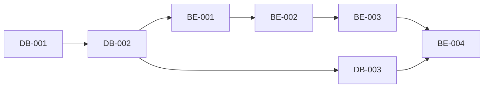

# Kanban Board

This directory contains work tickets for the Stock Screening Platform project, organized in a Kanban-style workflow.

## Directory Structure

```
docs/kanban/
├── backlog/       # Future work, not yet prioritized
├── todo/          # Ready to start, prioritized
├── in_progress/   # Currently being worked on
├── review/        # Completed, awaiting review
├── done/          # Completed and reviewed
└── README.md      # This file
```

## Ticket Categories

Tickets are prefixed by category:

- **DB-XXX**: Database setup and migrations
- **BE-XXX**: Backend API development
- **FE-XXX**: Frontend development
- **DP-XXX**: Data Pipeline (Airflow)
- **INFRA-XXX**: Infrastructure and DevOps
- **TEST-XXX**: Testing (future tickets)

## Ticket Format

Each ticket follows this structure:

### Metadata
- Status: TODO | IN_PROGRESS | REVIEW | DONE
- Priority: Critical | High | Medium | Low
- Assignee: Team member or TBD
- Estimated Time: Hours or days
- Sprint: Sprint number (1-3 for MVP)
- Tags: Categorization tags

### Content
- **Description**: What needs to be done
- **Subtasks**: Checklist of specific tasks
- **Acceptance Criteria**: How to verify completion
- **Dependencies**: What this ticket depends on / blocks
- **References**: Related documentation
- **Progress**: Percentage complete
- **Notes**: Additional context

## Sprint Structure (2-Week Cycles)

**Sprint Duration**: 2 weeks each
- **Sprint 1**: Week 1-2 (Foundation)
- **Sprint 2**: Week 3-4 (Core Features)
- **Sprint 3**: Week 5-6 (Polish & Advanced Features)

## Current Ticket Distribution

### Todo (Sprint 1: Week 1-2) - Foundation
**12 tickets ready to start**

Sprint 1 focuses on setting up the development environment, implementing authentication, and establishing the basic data pipeline.

**Database (4 tickets):**
- DB-001: PostgreSQL + TimescaleDB Environment Setup (Critical, 6h)
- DB-002: Database Schema Migration Implementation (Critical, 10h)
- DB-003: Indexes and Materialized Views Creation (High, 8h)
- DB-004: Database Functions and Triggers Implementation (Medium, 10h)

**Backend (3 tickets):**
- BE-001: FastAPI Project Initial Setup (Critical, 8h)
- BE-002: User Authentication API Implementation (Critical, 12h)
- BE-003: Stock Data API Implementation (Critical, 10h)

**Frontend (2 tickets):**
- FE-001: React + Vite Project Setup (Critical, 6h)
- FE-002: User Authentication UI Implementation (Critical, 10h)

**Data Pipeline (2 tickets):**
- DP-001: Apache Airflow Environment Setup (High, 6h)
- DP-002: Daily Price Ingestion DAG Implementation (Critical, 12h)

**Infrastructure (1 ticket):**
- INFRA-001: Docker Compose Multi-Container Setup (High, 8h)

**Sprint 1 Total**: 106 hours (~13 person-days)

**Sprint 1 Goal**:
- ✓ Development environment fully operational
- ✓ User authentication working (login/signup)
- ✓ Database schema deployed
- ✓ Daily price data ingestion pipeline running
- ✓ Basic stock listing API functional

---

### Backlog (Sprint 2+: Week 3+) - Core & Advanced Features
**11 tickets for future sprints**

#### Sprint 2 (Week 3-4) - Core Screening Features
**7 tickets:**

**Backend (2):**
- BE-004: Stock Screening API Implementation (Critical, 16h) - Sprint 2
- BE-005: API Rate Limiting and Throttling (High, 6h) - Sprint 2

**Database (1):**
- DB-005: Order Book Schema and Storage (Medium, 8h) - Sprint 2

**Data Pipeline (2):**
- DP-003: Indicator Calculation DAG Implementation (Critical, 16h) - Sprint 2
- DP-004: KIS API Integration (Critical, 20h) - Sprint 2

**Frontend (2):**
- FE-003: Stock Screener Page Implementation (Critical, 16h) - Sprint 2
- FE-004: Stock Detail Page Implementation (High, 14h) - Sprint 2

**Infrastructure (1):**
- INFRA-002: CI/CD Pipeline with GitHub Actions (High, 10h) - Sprint 2

**Sprint 2 Total**: 106 hours (~13 person-days)

**Sprint 2 Goal**:
- ✓ Stock screening functionality fully operational
- ✓ 200+ indicators calculated daily
- ✓ Real-time data integration (KIS API)
- ✓ Rate limiting protecting APIs
- ✓ CI/CD pipeline automated

---

#### Sprint 3 (Week 5-6) - Polish & Advanced Features
**4 tickets:**

**Backend (1):**
- BE-006: WebSocket Real-time Price Streaming (High, 16h) - Sprint 3

**Frontend (1):**
- FE-005: Order Book Visualization Component (Medium, 12h) - Sprint 3

**Infrastructure (1):**
- INFRA-003: Production Monitoring and Logging Setup (Medium, 12h) - Sprint 3

**Sprint 3 Total**: 40 hours (~5 person-days)

**Sprint 3 Goal**:
- ✓ Real-time WebSocket streaming operational
- ✓ Order book (호가) visualization for traders
- ✓ Production monitoring and alerting
- ✓ Performance optimization
- ✓ MVP ready for beta launch

## Workflow

1. **Backlog**: Product backlog, not yet prioritized
2. **Todo**: Ready to start, prioritized by sprint
3. **In Progress**: Developer actively working (limit: 1-2 per person)
4. **Review**: Code review, testing, verification
5. **Done**: Merged to main, deployed to staging/production

## Moving Tickets

To move a ticket between stages:

```bash
# Move from todo to in_progress
mv docs/kanban/todo/BE-001.md docs/kanban/in_progress/

# Update status in file
# Change: **Status**: TODO
# To:     **Status**: IN_PROGRESS

# Update progress percentage as you work
```

## Ticket Dependencies

Always check dependencies before starting work:



## Team Guidelines

1. **Limit WIP**: Maximum 2 tickets in "In Progress" per person
2. **Update Progress**: Update progress percentage daily
3. **Blocked Tickets**: Add "BLOCKED" label and note blocker
4. **Review Time**: Aim for < 24 hour review turnaround
5. **Definition of Done**:
   - All subtasks completed ✓
   - All acceptance criteria met ✓
   - Tests passing ✓
   - Code reviewed ✓
   - Deployed to staging ✓

## Metrics

Track these metrics weekly:

- **Velocity**: Tickets completed per sprint
- **Cycle Time**: Average time from todo → done
- **Lead Time**: Average time from backlog → done
- **WIP**: Current work in progress count
- **Blocked**: Number of blocked tickets

## Sprint Planning

Before each sprint:

1. Review completed tickets
2. Calculate velocity
3. Prioritize backlog
4. Move tickets to todo (based on velocity)
5. Assign tickets to team members
6. Update sprint goals

## Daily Standup

Each team member answers:

1. What did I complete yesterday?
2. What am I working on today?
3. Am I blocked? (If yes, move ticket and add note)

## References

- **PRD**: Product requirements and features
- **SRS**: Detailed software requirements
- **SDS**: Technical design and architecture

---

Last Updated: 2025-11-09
