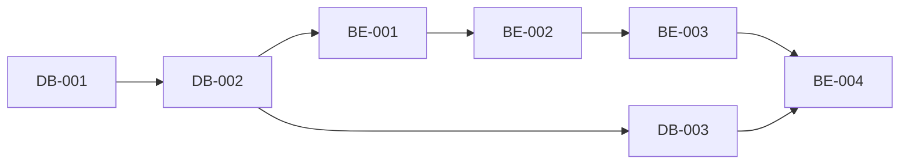

# Kanban Board

This directory contains work tickets for the Stock Screening Platform project, organized in a Kanban-style workflow.

## Directory Structure

```
docs/kanban/
├── backlog/       # Future work, not yet prioritized
├── todo/          # Ready to start, prioritized
├── in_progress/   # Currently being worked on
├── review/        # Completed, awaiting review
├── done/          # Completed and reviewed
└── README.md      # This file
```

## Ticket Categories

Tickets are prefixed by category:

- **DB-XXX**: Database setup and migrations
- **BE-XXX**: Backend API development
- **FE-XXX**: Frontend development
- **DP-XXX**: Data Pipeline (Airflow)
- **INFRA-XXX**: Infrastructure and DevOps
- **TEST-XXX**: Testing (future tickets)

## Ticket Format

Each ticket follows this structure:

### Metadata
- Status: TODO | IN_PROGRESS | REVIEW | DONE
- Priority: Critical | High | Medium | Low
- Assignee: Team member or TBD
- Estimated Time: Hours or days
- Sprint: Sprint number (1-3 for MVP)
- Tags: Categorization tags

### Content
- **Description**: What needs to be done
- **Subtasks**: Checklist of specific tasks
- **Acceptance Criteria**: How to verify completion
- **Dependencies**: What this ticket depends on / blocks
- **References**: Related documentation
- **Progress**: Percentage complete
- **Notes**: Additional context

## Current Sprint Tickets (MVP - Phase 1)

### Sprint 1 (Weeks 1-2) - Foundation
**Critical Path:**
1. DB-001 → DB-002 → DB-003 → DB-004 (Database setup)
2. BE-001 → BE-002 (Backend foundation + Auth)
3. FE-001 → FE-002 (Frontend foundation + Auth)
4. INFRA-001 (Docker Compose)
5. DP-001 (Airflow setup)

**Goal**: Development environment ready, authentication working

### Sprint 2 (Weeks 3-4) - Core Features
**Critical Path:**
1. BE-003 → BE-004 (Stock API + Screening API)
2. FE-003 → FE-004 (Screener page + Stock detail page)
3. DP-002 → DP-003 (Price ingestion + Indicator calculation)
4. INFRA-002 (CI/CD)

**Goal**: Core screening functionality working end-to-end

### Sprint 3 (Weeks 5-6) - Polish & Launch
**Critical Path:**
1. Remaining features (Portfolio, Alerts)
2. Testing and bug fixes
3. INFRA-003 (Monitoring)
4. Documentation
5. Performance optimization

**Goal**: MVP ready for launch

## Workflow

1. **Backlog**: Product backlog, not yet prioritized
2. **Todo**: Ready to start, prioritized by sprint
3. **In Progress**: Developer actively working (limit: 1-2 per person)
4. **Review**: Code review, testing, verification
5. **Done**: Merged to main, deployed to staging/production

## Moving Tickets

To move a ticket between stages:

```bash
# Move from todo to in_progress
mv docs/kanban/todo/BE-001.md docs/kanban/in_progress/

# Update status in file
# Change: **Status**: TODO
# To:     **Status**: IN_PROGRESS

# Update progress percentage as you work
```

## Ticket Dependencies

Always check dependencies before starting work:



## Team Guidelines

1. **Limit WIP**: Maximum 2 tickets in "In Progress" per person
2. **Update Progress**: Update progress percentage daily
3. **Blocked Tickets**: Add "BLOCKED" label and note blocker
4. **Review Time**: Aim for < 24 hour review turnaround
5. **Definition of Done**:
   - All subtasks completed ✓
   - All acceptance criteria met ✓
   - Tests passing ✓
   - Code reviewed ✓
   - Deployed to staging ✓

## Metrics

Track these metrics weekly:

- **Velocity**: Tickets completed per sprint
- **Cycle Time**: Average time from todo → done
- **Lead Time**: Average time from backlog → done
- **WIP**: Current work in progress count
- **Blocked**: Number of blocked tickets

## Sprint Planning

Before each sprint:

1. Review completed tickets
2. Calculate velocity
3. Prioritize backlog
4. Move tickets to todo (based on velocity)
5. Assign tickets to team members
6. Update sprint goals

## Daily Standup

Each team member answers:

1. What did I complete yesterday?
2. What am I working on today?
3. Am I blocked? (If yes, move ticket and add note)

## References

- **PRD**: Product requirements and features
- **SRS**: Detailed software requirements
- **SDS**: Technical design and architecture

---

Last Updated: 2025-11-09
